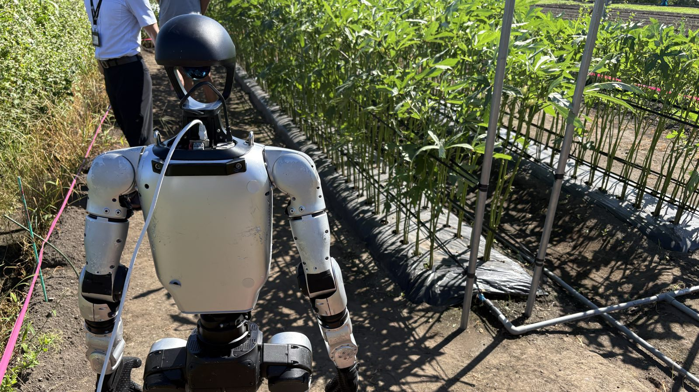

<div align="center">



# オクラ収穫ヒューマノイド — Unitree G1 × DimOS

**畑に立った人型ロボットが、支柱の間から実ったオクラを1本選び、刃を差し込んで切り落とす。**
そのために必要なものだけを積んだリポジトリです。

</div>

---

## これは何か

鹿児島県の圃場で動かしている、**Unitree G1 によるオクラ収穫システム**の実装です。
「オクラを見つける → 腕を伸ばす → 切って掴む」を、実機で通すところまで作り込んであります。

- **腕は7自由度の逆運動学で、狙った1点へ一発で伸ばす。** 到達したら刃を自動で閉じる。
- **狙う点は「人がクリック」でも「YOLOが検出」でも同じ。** 検出器の出力を人のクリックと
  **完全に同一のメッセージ**にしたので、下流のIKは入力元が人かAIかを知らない。
  自動と手動をワンスイッチで切り替えられる = 現場で詰まっても止まらない。
- **最後の数センチは学習ポリシーに任せられる。** 手首カメラ映像から拡散ポリシー（UMI）が
  手先を閉ループ微調整する経路も実装済み。
- **畑はオフラインで、ネットも人手も足りない。** だから電源投入の順番から e-stop の構え方、
  マルチキャスト経路の張り方まで、現場手順そのものをリポジトリに入れています。

土台は [Dimensional](https://dimensionalos.com) の **DimOS** です（[謝辞](#謝辞)）。
このフォークは G1 とオクラ収穫に必要なものだけを残し、他機種向けのコードは削除しています。

---

## 実機で確かめたこと（2026年7月）

| 項目 | 結果 | 根拠 |
|---|---|---|
| 実機での把持 | クリック→IKリーチ→自動全閉まで **LIVE 成功**（2026-07-15） | [AGX_ORIN_PORT_SPEC.md](oda/AGX_ORIN_PORT_SPEC.md) |
| 成功率 | **3/10**（位置ランダム・二重クリック確定方式・D435i構成、2026-07-22） | [REPORT_10TRIAL_2026-07-22.md](oda/REPORT_10TRIAL_2026-07-22.md) |
| 位置精度 | **全試行でズレ2cm以内**。爪の開口4cmに対し、成功/失敗の境界まで到達 | [ERROR_BUDGET.md](oda/ERROR_BUDGET.md) |
| 誤差の分解 | 誤差源9項目を実測で分解。上位2項（刃の+4cmオフセット／手首姿勢の不定）で**全体の8割**を占め、両方とも対策済み | [ERROR_BUDGET.md](oda/ERROR_BUDGET.md) |
| 自動検出 | 農場画像でオクラ2本を conf 0.95 / 0.81 で検出。既定は DRY-RUN、Enterゲート越しでのみ発火 | [DEMO_PLAN_2026-07-24.md](oda/DEMO_PLAN_2026-07-24.md) |
| 拡散ポリシー | 1ステップ **88ms**（要件100ms以下）でオフライン検証通過。実機統合は未 | [umi_diffusion/RUN.md](oda/umi_diffusion/RUN.md) |

> ズレの原因は人のクリックではありません。同じ的を2回狙うと**同じ方向に同じ量**ズレます。
> 機体の幾何誤差（組立公差＋サーボたわみ）が主因で、次の一手はハンドアイ校正です。
> 精度の問題は、すでに「最後の1〜2cm」まで来ています。

---

## 仕組み

```
┌─────────── 知覚 ───────────┐  ┌──── 判断 ────┐  ┌──────── 動作 ────────┐
 ZED Mini ──► YOLO seg 推論 ──► 3D点算出 ──► /clicked_point ──► IK reach ──► 把持
  (胸部)      (okra11n-seg)     (点群投影)   (人クリックと同契約)  (固定向き)   (自動全閉)
└────────────────────────────┘  └──────────────┘  └──────────────────────┘
      ラップトップ in-process        ブリッジ or 人         ブループリント本体
```

**設計の勘所**

1. **`/clicked_point` という1本の契約**。YOLOブリッジが出すのは、人がビューアでクリックした
   ときと同一の `PointStamped`。下流は入力元を区別しないので、自動化の失敗が把持の失敗に
   ならない（人が代われば続行できる）。
2. **手首の向きを毎回固定する**。7自由度の冗長性が「1発目は必ずズレる」の正体だったので、
   成功姿勢の向きを固定目標にした（`OKRA_FIXED_ORI_XYZW`）。
3. **安全は多重ゲート**。既定DRY-RUN／連続自動発火なし／Enterごとに1本／鮮度2秒／
   0.8m超の点は拒否／ワークスペース外と関節90°超の delta はブループリントが拒否。
4. **送信の継ぎ目は1か所**。実機への送信は `G1ArmSdkConnection`（250Hz、clip-to-measured、
   weightランプ）に集約。制御ラインを増やしてもここは変えない。

詳細: [PIPELINE_業務フロー.md](oda/PIPELINE_業務フロー.md)（P0〜P11のフェーズ表・データフロー・縮退プラン）

---

## 3つの制御ライン

| ライン | ブループリント | 標的の決め方 | 最後の数cm | 状態 |
|---|---|---|---|---|
| ① クリック→IK把持 | `unitree-g1-okra-ik-only-grasp` / `-zed` | 人が点群をクリック | スクリプト全閉 | **実機検証済** |
| ② YOLO自動検出 | `unitree-g1-okra-ik-only-grasp-zed` ＋ [yolo_click_bridge.py](oda/yolo_click_bridge.py) | okra11n-seg のマスク重心 | スクリプト全閉 | 検出は動作／実機発火は未検証 |
| ③ 拡散ポリシー微調整 | `unitree-g1-okra-ik-diffusion` | 人クリック（IKでpre-grasp） | 手首GoPro映像でUMI拡散ポリシーが閉ループ調整 | オフライン検証済 |

ACT（Action Chunking with Transformers）ラインは `unitree-g1-okra-harvest` / `-collect` に、キネステティック教示による
データ収集ごと残してあります（[STAGE_B_PLAN.md](dimos/robot/unitree/g1/act/STAGE_B_PLAN.md)）。

---

## ハードウェア

| 部位 | 構成 | 備考 |
|---|---|---|
| 機体 | Unitree G1（29DOF・上半身のみ使用） | 腕は `arm_sdk` 経由、歩行は使わない |
| ハンド | Dex1 グリッパ ＋ 収穫用カッター | 刃の前方オフセットは `OKRA_TIP_OFFSET_XYZ` で補正 |
| カメラ（現行） | ZED Mini（胸部・PC直結USB3） | 画角要件のため2026-07-23にこちらへ転換 |
| カメラ（従来） | RealSense D435i（頭部・Jetson NX でLCM中継） | `scripts/install_nx_cam_service.sh` でsystemd常駐化 |
| 手首カメラ | GoPro / UVC（Elgato経由） | UMI拡散ポリシーの唯一の入力 |
| LiDAR | Livox Mid-360 ＋ FastLIO2 | ナビゲーション系ライン用 |
| 計算機 | ラップトップ（RTX 3070） | 移植先候補は Jetson AGX Orin 64GB（[移植仕様書](oda/AGX_ORIN_PORT_SPEC.md)） |

---

## 畑での動かし方

オフライン環境向けの3ステップ。詳細は [README_FARM.md](oda/README_FARM.md) と
[FARM_QUICKSTART.md](oda/FARM_QUICKSTART.md)、環境変数の一覧は
[RUN_CHEATSHEET.md](oda/RUN_CHEATSHEET.md) にあります。

```bash
# 0) 準備: G1電源ON（刃は閉じてから）→ リモコン L2+↑ → R1+Y
#    ZEDはUSB3ポート4-4へ、PCはAC電源、ロボットLANは有線、e-stop(L2+B)を手元に

# 1) 段階1 — DRY-RUN（腕は動かさず、検出した3D座標だけ表示）
bash oda/start_zed_yolo_auto.sh

# 2) 段階2 — ホバー（狙い点の5cm手前で停止。掴まずに奥行きを検証）
bash oda/start_zed_yolo_auto.sh --hover

# 3) 段階3 — 本番（IKリーチ＋自動全閉）
bash oda/start_zed_yolo_auto.sh --live
```

起動後は同じ端末で **Enter = オクラ1本を検出して収穫 / q+Enter = 全停止**
（q+Enter でアプリとビューアも片付きます）。

段階を飛ばさないこと。DRY-RUN → ホバー → 本番の順に上げるのが、この構成の安全設計です。
試行のあいだは必ず腕を初期姿勢へ戻します（伸ばしっぱなしは事故になります）。

```bash
.venv/bin/python oda/arm_home.py      # 爪を開いて腕を引く
.venv/bin/python oda/gripper_open.py  # 爪だけ開く
```

---

## 主要ブループリント

```bash
.venv/bin/dimos list                  # 全ブループリント一覧
```

| コマンド | 何をするか |
|---|---|
| `dimos run unitree-g1-okra-ik-only-grasp` | 頭部D435i、クリック→IKリーチ→スクリプト把持 |
| `dimos run unitree-g1-okra-ik-only-grasp-zed` | 胸部ZED Mini版（現行の本番構成） |
| `dimos run unitree-g1-okra-ik-diffusion` | IKでpre-grasp後、UMI拡散ポリシーが手先を微調整 |
| `dimos run unitree-g1-okra-harvest` | クリック→IK→ACTで把持（学習ポリシーライン） |
| `dimos run unitree-g1-okra-collect` | キネステティック教示によるデータ収集 |
| `dimos run unitree-g1-mid360-fastlio` | Mid-360 LiDAR＋FastLIOのオドメトリ |
| `dimos run unitree-g1-nav-laptop` | ラップトップ側からG1のナビゲーションスタックを回す |
| `dimos --simulation run unitree-g1-sim` | 実機なしでMuJoCoシミュレーション |

---

## リポジトリ構成

```
oda/                         オクラ案件の現場資産
├── start_*.sh               畑でこれ1本叩けば全部起動するスクリプト
├── run_okra_ik_only_grasp.py / yolo_click_bridge.py
├── arm_home.py / gripper_*.py / gravity_calib.py    運用・診断ツール
├── umi_diffusion/           拡散ポリシー推論サーバと前処理検証
├── mujoco_sim/              オクラ畑シーンでの机上検証
├── ZED_M_Depth_check/       ZEDの深度品質確認とYOLOファインチューン
└── *.md                     計画書・運用手順・報告書・誤差予算

dimos/robot/unitree/g1/      G1本体の実装
├── act/                     arm_sdk送信・グリッパ・IKリーチ・UMI/ACTブリッジ
├── blueprints/manipulation/ unitree_g1_okra_*（収穫アプリ）
├── blueprints/navigation/   Mid-360/FastLIO・ナビゲーション
└── IK_REACH_PLAN.md         IKリーチの設計・ICD・段階検証計画

scripts/                     記録・再生・校正・カメラ配信
├── okra_kinesthetic_capture.py / okra_lerobot_writer.py / okra_export_view.py
├── handeye_calib.py / g1_replay.py / act_service.py
└── install_nx_cam_service.sh / *_zmq_publisher.py

yokote/                      G1のカメラ・LiDAR不具合の実地調査報告（別ライン）
docs/                        DimOS由来のドキュメント（英語）
```

---

## ドキュメント地図

**まず読む**
- [PIPELINE_業務フロー.md](oda/PIPELINE_業務フロー.md) — 収穫1本の全工程・担当・判定ゲート
- [README_FARM.md](oda/README_FARM.md) — 畑での作業手順（3ステップ）
- [RUN_CHEATSHEET.md](oda/RUN_CHEATSHEET.md) — 起動前チェック・環境変数・トラブル対処

**設計・計画**
- [IK_REACH_PLAN.md](dimos/robot/unitree/g1/IK_REACH_PLAN.md) — IKリーチの設計とICD
- [STAGE_B_PLAN.md](dimos/robot/unitree/g1/act/STAGE_B_PLAN.md) — ACTのDimOS移植計画
- [SETUP.md](dimos/robot/unitree/g1/act/SETUP.md) — ACTを一から動かす手順
- [umi_diffusion/RUN.md](oda/umi_diffusion/RUN.md) — 拡散ポリシーの起動と段階的ロールアウト
- [Orboh/Dex1-1hand_UMI](https://github.com/Orboh/Dex1-1hand_UMI) — 拡散ポリシーの学習元。
  UMI（改造Dex1-1カッターハンド）でのデータ収集・EKFによる軌道生成・
  Diffusion Policy/ACT/Flow Matching学習パイプライン
- [AGX_ORIN_PORT_SPEC.md](oda/AGX_ORIN_PORT_SPEC.md) — Jetson AGX Orin への移植仕様

**運用・実績**
- [FARM_QUICKSTART.md](oda/FARM_QUICKSTART.md) / [RUN_ZED_IK.md](oda/RUN_ZED_IK.md) / [RUN_ZED_YOLO_IK_AUTO.md](oda/RUN_ZED_YOLO_IK_AUTO.md)
- [DEMO_PLAN_2026-07-24.md](oda/DEMO_PLAN_2026-07-24.md) — デモ当日の構成と台本
- [ERROR_BUDGET.md](oda/ERROR_BUDGET.md) — ズレの誤差予算（実測ベース）
- [REPORT_10TRIAL_2026-07-22.md](oda/REPORT_10TRIAL_2026-07-22.md) — 10回テストの報告
- [SETUP_THIS_PC.md](oda/SETUP_THIS_PC.md) — 開発PCの構築手順

**このリポジトリで作業するAIエージェント向け**
- [AGENTS.md](AGENTS.md) — CLI・ブループリント・モジュール機構・スキル追加の作法

---

## 現場セットアップ

### G1 初期セットアップ（Orboh — 新しい個体・NX再フラッシュ後は必須）

> ⚠️ **G1の頭部カメラ配信は、ロボットのオンボードコンピュータ（NX, `192.168.123.164`）への
> ワンタイムセットアップが必要です。** 新しいG1個体を触るとき、またはNXが再フラッシュされた後は、
> SSH鍵・カメラ配信サービスがすべて消えているため、以下を一度実行してください：

```bash
# ラップトップから1コマンド（NXのパスワードを聞かれる。デフォルト: 123）
scripts/install_nx_cam_service.sh
```

これで `g1-cam-publisher` がsystemdサービスとして登録され、**以後はG1の電源を入れるだけで
頭部カメラ（D435i → ZMQ `tcp://*:5555`）が自動配信されます**（実機で再起動2回検証済み 2026-06-06）。

- 動作確認: `dimos run unitree-g1-nav-laptop-cam` → Rerun viewerのCameraパネルに映像
- NX側ログ: `ssh unitree@192.168.123.164 journalctl -u g1-cam-publisher -f`
- 詳細・トラブルシュート: `docs/platforms/humanoid/g1/index_orboh_make.md`
- 任意（SSH快適化）: `ssh-copy-id -i ~/.ssh/id_ed25519_g1.pub unitree@192.168.123.164`

### JetsonをWiFi AP化する手順（Orboh — 現場で無線直結したい時）

**目的**: JetsonにノートPCを直接無線接続してSSHしたい場合、Jetson自身をWiFiアクセスポイント(AP)にする。
社内WiFi / DHCPに依存せず、APモード時のJetsonは常に固定IP `192.168.12.1`。
再起動後も自動でAPが立つよう常駐化する。OSSの [`oblique/create_ap`](https://github.com/oblique/create_ap) を使用。

> [!WARNING]
> **APと通常WiFi（STA）は同時使用不可。** WiFiチップは1個なので、AP化するとそのJetsonは
> **インターネットに繋がらなくなる**（社内WiFi経由のネットを失う）。

> [!WARNING]
> **作業中のロックアウトに注意。** WiFi経由でSSH中にWiFiをAPに切り替えると接続が切れる。
> **WiFi以外の入口（有線 or モニタ直結）を必ず確保してから作業すること。**
> AGX Orinには有線LANポートがあるので、下記「有線直結」を先に済ませるのが最も安全。

#### 1. インストール（Jetson上）

```bash
git clone https://github.com/oblique/create_ap && cd create_ap
sudo make install
sudo apt install -y hostapd dnsmasq network-manager
```

> [!NOTE]
> `apt install` 時に `hostapd.service failed to start` と出るのは**無害**。
> create_ap は独自のプロセスとして hostapd を起動するため、systemd サービスとして上がる必要はない。

#### 2. WiFiインターフェース名とAPモード対応を確認

```bash
iw dev | grep Interface                          # AGX Orin: wlP1p1s0 / NX: wlan0
iw list | grep -A8 "Supported interface modes"   # "* AP" があればOK
```

#### 3. `/etc/create_ap.conf` を編集

以下は SSID `agx` / パスワード `agx12345` の例（AGX Orin, IF名 `wlP1p1s0`）。
IF名は手順2で確認した値に合わせること。

```bash
sudo sed -i \
  -e 's/^WIFI_IFACE=.*/WIFI_IFACE=wlP1p1s0/' \
  -e 's/^SSID=.*/SSID=agx/' \
  -e 's/^PASSPHRASE=.*/PASSPHRASE=agx12345/' \
  -e 's/^GATEWAY=.*/GATEWAY=192.168.12.1/' \
  -e 's/^SHARE_METHOD=.*/SHARE_METHOD=none/' \
  -e 's/^NO_VIRT=.*/NO_VIRT=1/' \
  -e 's/^INTERNET_IFACE=.*/INTERNET_IFACE=/' \
  /etc/create_ap.conf
```

- `SHARE_METHOD=none` — インターネット共有なし
- `NO_VIRT=1` — AP仮想IF非対応アダプタ向け（安全側）
- `INTERNET_IFACE=` — 空のまま

#### 4. WiFiを切断（STA/AP同時不可）

```bash
sudo nmcli device disconnect wlP1p1s0   # NXの場合は wlan0
```

STAのまま create_ap を起動しようとすると `can not be a station and an AP at the same time` エラーが出る。

#### 5. NMが起動時にWiFiを先取りしないよう全wifiプロファイルの自動接続をOFF

```bash
for c in $(nmcli -t -f NAME,TYPE connection show | grep ":802-11-wireless$" | cut -d: -f1); do
  sudo nmcli connection modify "$c" connection.autoconnect no
done
```

#### 6. create_ap を有効化・起動

```bash
sudo systemctl enable --now create_ap
```

再起動後も自動でAPが立ち上がる。

#### 接続方法

ノートPCのWiFiを `agx`（パスワード `agx12345`）に繋ぎ、SSHする。

```bash
ssh tbr@192.168.12.1    # AGX Orin の例。ユーザー名は各機体に合わせる
```

#### 有線直結（強く推奨 — ロックアウト防止・救出用）

AGX Orinの有線 `eno1` には NetworkManager プロファイル「Wired connection 1」で
**静的 `192.168.123.222`** が設定済み（再起動後も維持）。

```bash
# ノートPC側NICを 192.168.123.50/24 に設定してから:
ssh tbr@192.168.123.222    # WiFiの状態に関わらず常に到達できる
```

- AP化作業中はこの有線でSSHしながら作業すると安全
- AP切り替え失敗時の救出にも使える

#### インターネットが必要になったとき（AP ⇄ 通常WiFi切替）

```bash
# 一時的に社内WiFiに戻す（ネット復活。DHCPでIPは変わる）
sudo systemctl stop create_ap
sudo nmcli connection up <wifi-profile-name>

# APに戻す
sudo systemctl start create_ap
```

完全にAPをやめる場合:

```bash
sudo systemctl disable create_ap
# wifiプロファイルの autoconnect を yes に戻す
for c in $(nmcli -t -f NAME,TYPE connection show | grep ":802-11-wireless$" | cut -d: -f1); do
  sudo nmcli connection modify "$c" connection.autoconnect yes
done
```

#### 動作確認（実機検証済み 2026-06-10）

AGX Orinを電源OFF→ONしても `create_ap` が自動起動することを確認済み。

```bash
systemctl is-active create_ap    # → active
systemctl is-enabled create_ap   # → enabled
ip addr show wlP1p1s0            # → inet 192.168.12.1/24 が割り当て済み
```

`agx` SSID が信号強度100で発信されていること、ノートPCから `ssh tbr@192.168.12.1` で到達できることを確認済み。


---

## 開発

```bash
# 依存の同期（uv 管理・Python 3.12）
uv sync --extra all

# テスト（fast のみ。self_hosted は実機/LFSが必要）
uv run pytest --numprocesses=auto dimos

# 型チェック
uv run mypy dimos

# pre-commit のフックを有効化（コミット前検査）
uv run pre-commit install
```

> pre-commit の Doclinks フックは `python` が PATH にあることを前提にしています。
> コミットする前に `source .venv/bin/activate` してください（`python3` しか無い環境では
> `Executable \`python\` not found` でコミットが止まります）。

- インストール手順: [docs/installation/](docs/installation/)（[Ubuntu](docs/installation/ubuntu.md) / [macOS](docs/installation/osx.md) / [Nix](docs/installation/nix.md)）、対話インストーラは `scripts/install.sh`
- テストの分類と流し方: [docs/development/testing.md](docs/development/testing.md)
- モジュールとブループリントの書き方: [docs/usage/modules.md](docs/usage/modules.md) / [docs/usage/blueprints.md](docs/usage/blueprints.md)
- G1 のプラットフォーム資料: [docs/platforms/humanoid/g1/index.md](docs/platforms/humanoid/g1/index.md) / [Orboh 個体のセットアップ](docs/platforms/humanoid/g1/index_orboh_make.md)

新しいブループリントを足したら、レジストリを再生成してください。

```bash
uv run pytest dimos/robot/test_all_blueprints_generation.py   # all_blueprints.py を自動生成
```

---

## 謝辞

本リポジトリは [Dimensional Inc.](https://dimensionalos.com) が開発する **DimOS**
（[dimensionalOS/dimos](https://github.com/dimensionalOS/dimos), Apache-2.0）のフォークです。

モジュール／ブループリント機構、LCMトランスポート、Pinocchio による逆運動学、点群・地図・
Rerun 可視化、そして実機に安全に送信するための継ぎ目——農業ロボットを作るうえで本来なら
何ヶ月もかかる土台が、最初から揃っていました。そのおかげで私たちは「畑でオクラを1本掴む」
という一点に集中でき、フォークから実機把持まで数ヶ月で到達できました。

DimOS をオープンソースとして公開してくれている Dimensional のチームに深く感謝します。
**Thank you, Dimensional.**

オクラ収穫に関するコード（`oda/`, `dimos/robot/unitree/g1/act/`, `unitree_g1_okra_*` 等）と
現場運用ドキュメントは Orboh, Inc. が追加したものです。上流のドキュメントは
[docs/](docs/) に残してあります。

---

## ライセンス

[Apache License 2.0](LICENSE) — Copyright 2025 Dimensional Inc.
本フォークでの追加・変更部分も同ライセンスで提供します。
